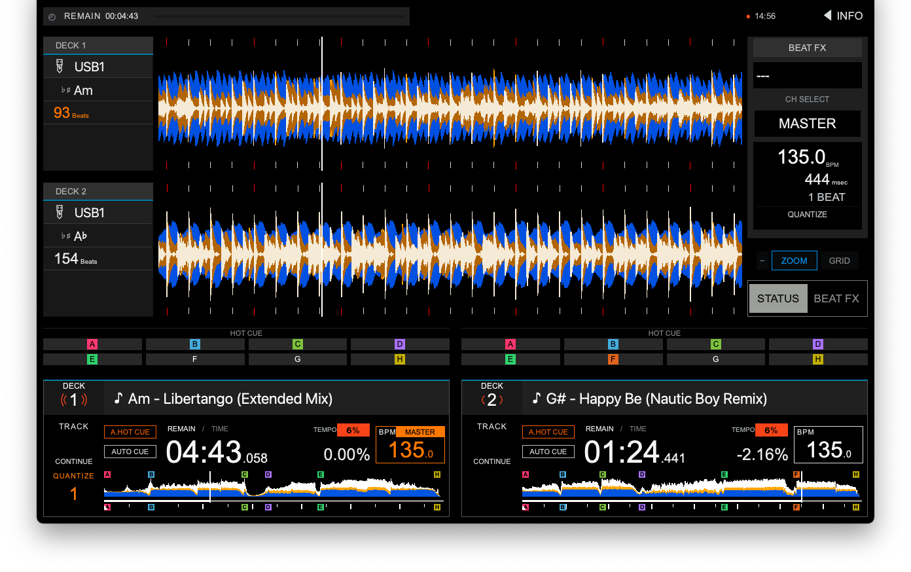
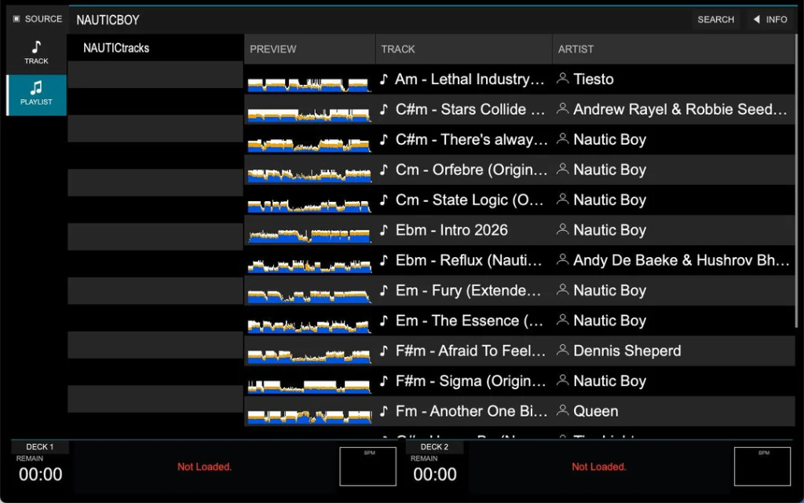
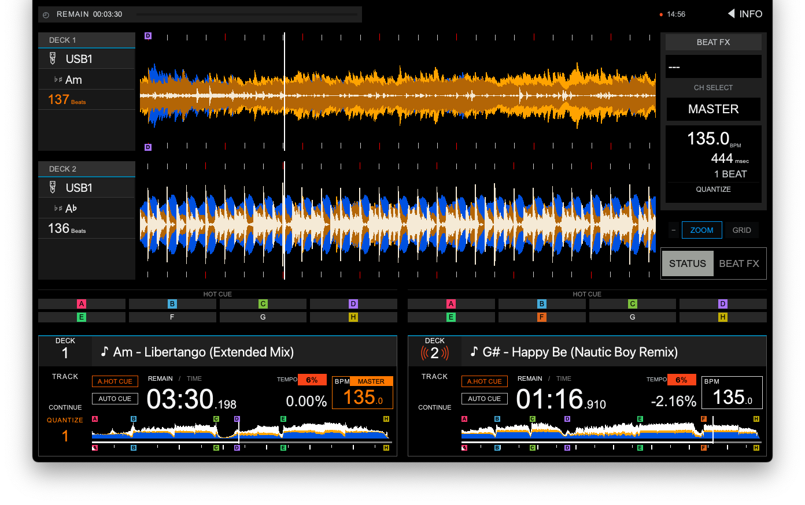
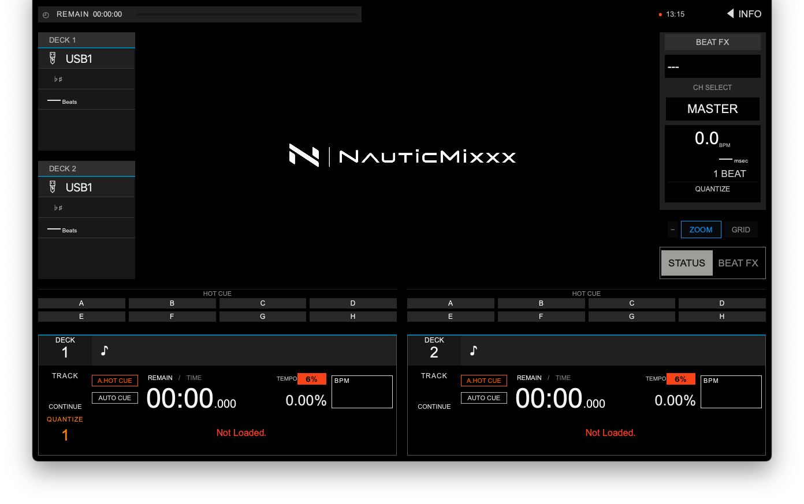
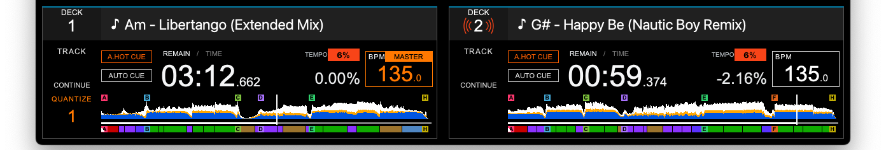

# NauticMixxx

## Your Rekordbox USB. Straight to the dancefloor.

NauticMixxx is an open-source DJ application for macOS and Windows, based on Mixxx 2.5.6 and featuring an interface inspired by the XDJ-RX3. Plug in a Rekordbox-exported USB drive, browse your playlists, and load tracks onto two decks to practice or prepare your next set.

**[Visit Website](https://nauticmixxx.nauticboy.top/) · [English](https://nauticmixxx.nauticboy.top/en/) · [Download NauticMixxx](https://github.com/nauticsoftware/NauticMixxx/releases/latest) · [Donate (Buy Me a Coffee)](https://www.buymeacoffee.com/NauticSoftware)**



**Read-only USB · No local library scan · No registration · Open source**

## Prepare your set once. Play it anywhere.

The website presents a workflow designed for DJs who prepare their music in Rekordbox and want to bring that preparation to a computer with DJ controllers.

- **Direct USB reading.** Browse your Rekordbox-exported catalog and playlists without importing tracks into the local library.
- **Your prep work, front and center.** Waveforms, beatgrids, track overviews, and up to eight Hot Cues per deck.
- **Two mixing decks.** Remaining time, BPM, tempo, and playback controls, along with the Beat FX section.
- **Hardware control.** Dedicated mapping for Hercules Inpulse 500 and RX3 presets for various Pioneer and Roland controllers.
- **Downloads and documentation.** Access installers, source code, release notes, guides, and test reports published on GitHub.

## The interface in action

The website includes different screenshots distributed throughout the page and optional playback and browsing demos with standard video controls. Videos load on demand. Screenshots can be expanded in a keyboard-accessible dialog.

[Explore the gallery and animations](https://nauticmixxx.nauticboy.top/#screens)

| Rekordbox Browser | Mixing & Waveforms |
| --- | --- |
|  |  |
| Playlists, tracks, and waveform previews. | Beatgrid, tempo, and waveforms for both decks. |

### Before loading tracks



### Dual-deck controls



## Your USB remains untouched

The USB workflow is designed to operate in read-only mode. NauticMixxx does not rewrite audio files, metadata, playlists, or analysis data on the drive, maintaining its catalog as a transient session.

The local library remains outside of this browser. Keep a backup of your working USB drive and stop playback before ejecting it from your operating system.

## Download NauticMixxx

The website displays the latest release published on GitHub and links to the available files for that release.

| Platform | Download |
| --- | --- |
| macOS Apple Silicon | ARM64 installer. |
| Windows x64 | Native Windows installer. |
| Source code | Source files to build and review the project. |

**[View the latest release and downloads](https://github.com/nauticsoftware/NauticMixxx/releases/latest)**

The download section and navigation button automatically match the visitor’s desktop system, with monochrome Apple branding or Windows blue. Other systems show both downloads, and both installers remain accessible under the release details. macOS downloads require Apple Silicon. Expand “More downloads and release details” for source files, release notes, test reports, checksums, and the experimental Linux build guide. Installation help is available alongside the downloads.

## Getting started

1. **Install the application.** Download the installer for your operating system from the latest release.
2. **Configure audio output.** Select your device and channels in `Preferences → Sound Hardware`. If using a controller, configure it under `Controllers`.
3. **Connect your Rekordbox-exported USB drive.** Wait for the catalog to finish loading and open `SOURCE`.
4. **Browse and load a track.** Select a playlist, press `ENTER` to view its tracks, and use `LOAD 1/2` to load the corresponding deck.

The website includes links to the installation guide, controller guide, and the [GitHub support channel](https://github.com/nauticsoftware/NauticMixxx/issues).

## Frequently Asked Questions

**Does NauticMixxx install directly on a Pioneer XDJ-RX3?**

It runs on your computer. It does not install on Pioneer hardware or modify its firmware.

**Which controllers are featured on the website?**

The Hercules Inpulse 500 has a dedicated mapping. The website also provides presets for DDJ-400, DDJ-SX, DDJ-SX2, DDJ-SX3, DDJ-WeGO3, DDJ-FLX4, and Roland DJ-505. Physical testing for these presets is pending; SX3 is experimental. Refer to the release guide and test report to check their current limitations.

**Where can I find the latest installers?**

On [GitHub Releases](https://github.com/nauticsoftware/NauticMixxx/releases/latest). If a release does not include a prebuilt installer for your platform, the website directs you to its available downloads.

## Support development

NauticMixxx is an independent, open-source project. If the application helps you practice, prep your sets, or perform live, you can support ongoing development, hosting, and testing with new controllers by buying me a coffee:

[](https://www.buymeacoffee.com/NauticSoftware)

## Open Source & Credits

NauticMixxx is an independent community project. The adaptation is distributed under GNU GPL v3.0, and the Mixxx 2.5.6 engine is under GNU GPL v2.0 or later. The [NauticMixxx project](https://github.com/nauticsoftware/NauticMixxx) publishes the source code, patches, and attributions.

It is not affiliated with, sponsored by, certified, or endorsed by AlphaTheta, Pioneer DJ, Hercules, rekordbox, or the Mixxx project. Brand and product names are used solely to describe compatibility, technical origin, or workflow.

<details>
<summary>Website development</summary>

The Apple and Windows logo silhouettes are bundled locally from [Simple Icons v11](https://github.com/simple-icons/simple-icons/tree/11.0.0/icons).

The website is built with React and Vite, with prerendered content in English and Spanish. The responsive design uses a premium dark theme, readable typography, orange accents (#FF7800 / #F84418), blue details (#0051E1 / #027CC8), and distinct charcoal (#202020) and black surfaces. Navigation, downloads, setup instructions, FAQs, and optional project support focus on everyday DJ use. The mobile menu, directly visible screenshots, native modal dialog, reduced-motion support, and on-demand video playback preserve accessibility and keep the page lightweight.

```bash
npm install
npm run dev
npm run build
```

</details>
